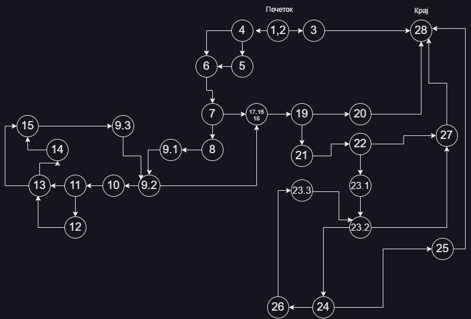

## Втора лабораториска задача по СИ - Живче Глигоров 216139
> **1.Control Flow Graph**  
>  

> **2.Цикломатската комплексност**  
> Согласно 1. постојат 11 predicate nodes : (1,2), (4), (7), (9.2), (11), (13), (19), (22), (23.2), (24) ;  
> Согласно формулата: Цикломатската комплексност = број на предикатни јазли + 1  
> Цикломатската комплексност = 11  

> A = null, new ArrayList()<> 
> B = new User(Kalu, kafanska pjevacica@, kalu.dragoliev@gmail.com ), new List.of(new User(Predrag, desamsinocbio@, predrag.petkov@gmail.com )  
> C = new User(Kalu, kafanskapjevacica, kalu.dragoliev@gmail.com ), new List.of( new User(Kalu, kafanskapjevacica, kalu.dragoliev@gmail.com )  
> D = new User(Kalu, kafanska pjevacica@, kalu.dragoliev@gmail.com ), new List.of(new User(Predrag, desamsinocbio@, predrag.petkov@gmail.com )  
> A | B | C | D
> ---|---|---|---
> * | | |
> | * | * | *
> * | | |
> NOT | NOT | NOT |
> | * | * | *
> | * | * | *
> | | * | *
> | * | |
> | | * | *
> | | * | *
> | | * | *
> | | * | *
> | | * | 
> | | | *
> | | * | 
> | | * | 
> | | | *
> | | * |
> | | * | *
> | | * | *
> | | * | *
> | * | * | *
> | * | |
> | * | |
> | | * | * 
> | | * | *
> | | | *
> | | * |
> | | * |
> | | * |
> | | * |
> | | * |
> | | | *
> | | | *
> | | * |
> | | * |

