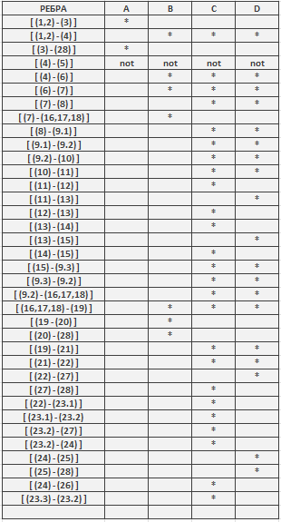

## Втора лабораториска задача по СИ - Живче Глигоров 216139 <br>
> **1.Control Flow Graph** <br>
>   

<hr></hr>

> **2.Цикломатската комплексност** <br>
> Согласно 1. постојат 11 predicate nodes : (1,2), (4), (7), (9.2), (11), (13), (19), (22), (23.2), (24) ; <br>
> Согласно формулата: Цикломатската комплексност = број на предикатни јазли + 1 <br>
> Цикломатската комплексност = 11 <br>

<hr></hr>


> **3. Every-branch** <br>
> ```
> A =  SILab2.function(null, new ArrayList<>())  
> B =  SILab2.function(new User("kalu", "kalu123", "kalugmailcom"), new ArrayList<>()) 
> C =  SILab2.function(new User("kalu", "kafanskapjevacica", "kalu.dragoliev@gmail.com"), List.of(new User("kalu", "kafanskajevacica", "kalu.dragoliev@gmail.com"))) 
> D =  SILab2.function(new User("kalu", "kafanska pjevacica@", "kalu.dragoliev@gmail.com"), List.of(new User("Predrag", "desambiosinoc", "predrag.petkov@gmail.com"))) 
> ````
> 
 - Првиот тест е наменет соодветно за
 -
 -
 -

> ```
> class SILab2Test {
>
>   @Test
>   void exceptionTest() {
>       RuntimeException exception = assertThrows(RuntimeException.class, () -> {
>           SILab2.function(null, new ArrayList<>());
>       });
>       assertEquals("Mandatory information missing!", exception.getMessage());
>
>   }
>
>   @Test
>   void loopTest() {
>       assertFalse(SILab2.function(new User("kalu", "kalu123", "kalugmailcom"), new ArrayList<>()));
>       assertFalse(SILab2.function(new User("kalu", "kafanskapjevacica", "kalu.dragoliev@gmail.com"), List.of(new User("kalu", "kafanskajevacica", "kalu.dragoliev@gmail.com"))));
>       assertFalse(SILab2.function(new User("kalu", "kafanska pjevacica@", "kalu.dragoliev@gmail.com"), List.of(new User("Predrag", "desambiosinoc", "predrag.petkov@gmail.com"))));
>   }
> }
> ```

<hr></hr>

> **4. Multiple Condition**
> ```
> A =  SILab2.function(null, new ArrayList<>()) 
> B =  SILab2.function(new User("kalu", "kalu123", "kalugmailcom"), new ArrayList<>()) 
> ````
 | | A | 	B | 
 | :---------- | ---------- |   ---------- | 
 | T T T |	* |  |	
 | F F F	|	  | * |
 | T F F	| NOT | NOT |
 | F F T	| NOT |	NOT |
 | F T F	| NOT |	NOT |
 | T T F	| NOT |	NOT |
 | T F T	| NOT |	NOT |
 | F T T	| NOT |	NOT |
 
 **Доколку во поле се сретне _NOT_ тоа означува дека таа комбинација не е можна согласно зададената задача!**
> ```
>  @Test
>   void  multipleConcitionTestV1(){
>       RuntimeException exception=assertThrows(RuntimeException.class, ()->{
>          SILab2.function(null,new ArrayList<>());
>       });
>       assertEquals("Mandatory information missing!", exception.getMessage());
>
>   }
>   @Test
>   void  multipleConcitionTestV2(){
>       assertDoesNotThrow(()->{
>          SILab2.function(new User("Predrag","Mitkov12345","predrag_mitkov@gmail.com"),new ArrayList<>());
>       });
>   }
> ````
