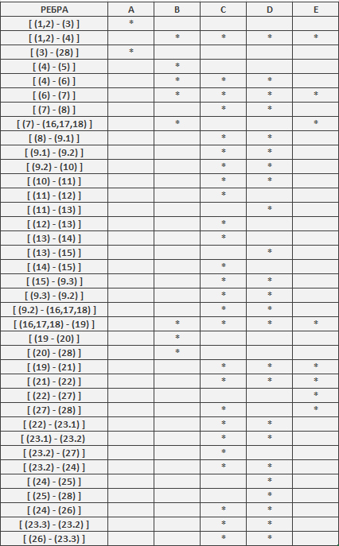

## Втора лабораториска задача по СИ - Живче Глигоров 216139
> **1.Control Flow Graph**
>  

> **2.Цикломатската комплексност**  
> Согласно 1. постојат 11 predicate nodes : (1,2), (4), (7), (9.2), (11), (13), (19), (22), (23.2), (24) ;
> Согласно формулата: Цикломатската комплексност = број на предикатни јазли + 1
> Цикломатската комплексност = 11
> **3. Every-branch** 
>  
